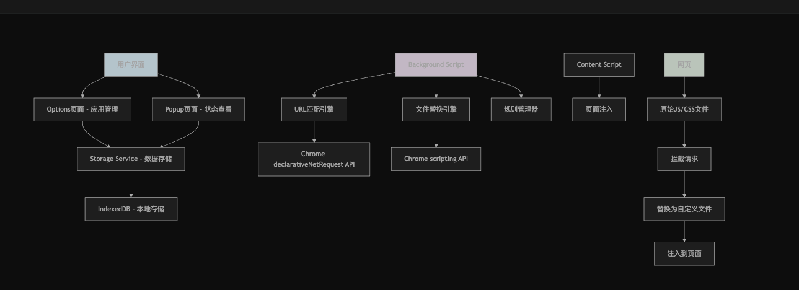
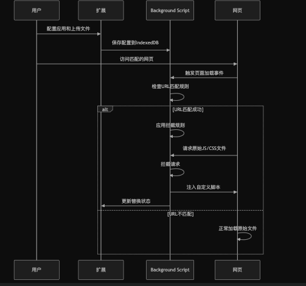

## 项目概述

**APaaS 脚本替换工具** 是一个Chrome浏览器扩展程序，主要用于在网页中动态替换JavaScript和CSS文件。这个工具特别适用于APaaS（应用程序平台即服务）平台的开发和测试场景。

## 主要功能

### 🎯 核心功能
1. **脚本文件替换**：将网页中的原始JS/CSS文件替换为用户上传的自定义文件
2. **多应用管理**：支持创建、编辑和删除多个替换应用配置
3. **URL匹配规则**：通过配置URL模式来精确控制何时触发文件替换
4. **包文件管理**：每个应用可以上传多个压缩包，包含不同的脚本文件

### 🔧 技术特点
- **实时替换**：使用Chrome扩展的declarativeNetRequest API拦截网络请求
- **动态注入**：通过scripting API将自定义脚本注入到页面中
- **本地存储**：使用IndexedDB存储应用配置和文件数据
- **开发模式支持**：支持开发环境下的实时文件替换

## 使用场景

### 典型应用场景：
1. **前端开发调试**：在生产环境中测试本地开发的脚本
2. **APaaS平台定制**：为APaaS平台注入自定义的业务逻辑
3. **A/B测试**：在不同页面版本间快速切换
4. **热修复**：临时修复生产环境中的脚本问题

## 技术架构

## 技术栈

### 前端技术
- **React 19** - 用户界面框架
- **TypeScript** - 类型安全的JavaScript
- **Tailwind CSS** - 样式框架
- **shadcn/ui** - UI组件库
- **Lucide React** - 图标库

### 扩展开发
- **Plasmo框架** - Chrome扩展开发框架
- **Chrome Extension Manifest V3** - 最新的扩展清单版本
- **Chrome APIs**：
  - `declarativeNetRequest` - 网络请求拦截
  - `scripting` - 脚本注入
  - `storage` - 数据存储
  - `tabs` - 标签页管理

### 数据存储
- **IndexedDB** - 浏览器本地数据库
- **idb-keyval** - IndexedDB的简化接口

## 工作流程

### 文件替换流程：

## 项目特色

### 🚀 优势特点
1. **无侵入性**：不需要修改原网站代码，通过扩展实现文件替换
2. **灵活配置**：支持复杂的URL匹配规则和多应用管理
3. **开发友好**：支持开发模式，便于实时调试
4. **安全可靠**：使用Chrome官方API，符合最新安全标准

### 📦 文件格式要求
上传的ZIP包必须包含：
- `apaas.json` 配置文件（指定outputName）
- `{outputName}.umd.js` JavaScript文件
- `{outputName}.css` CSS文件（可选）
- `{outputName}.umd.worker.js` Worker文件（可选）

## 总结

这是一个专业的Chrome扩展工具，主要服务于前端开发者和APaaS平台用户。它通过拦截和替换网页中的脚本文件，为开发调试、测试部署和平台定制提供了强大而灵活的解决方案。项目采用现代化的技术栈，代码结构清晰，功能完整，是一个高质量的浏览器扩展项目。
