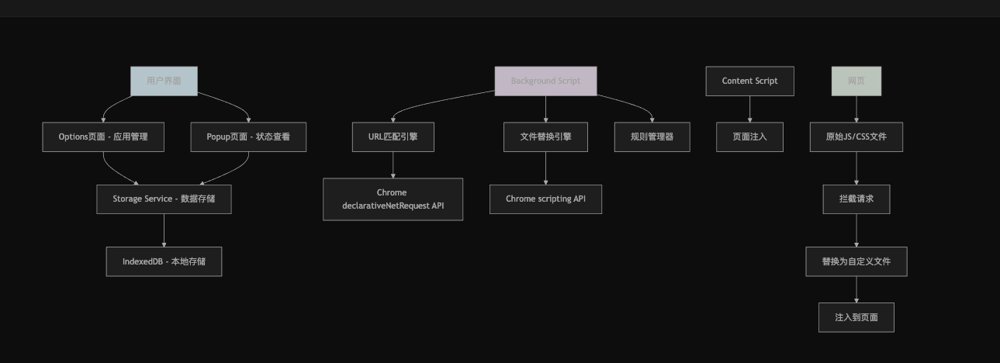
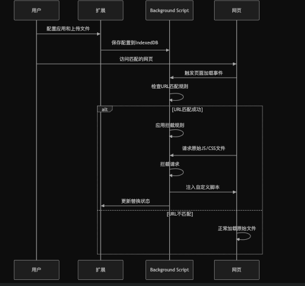

## 介绍

**APaaS 脚本替换工具** 是一个 Chrome 浏览器扩展程序，主要用于在网页中动态替换 JavaScript 和 CSS 文件。这个工具特别适用于 APaaS（应用程序平台即服务）平台的开发和测试场景。

### 🎯 核心功能
1. **脚本文件替换**：将网页中的原始 JS/CSS 文件替换为本地开发的自定义文件
2. **多应用管理**：支持创建、编辑和删除多个替换应用配置
3. **URL 匹配规则**：通过配置 URL 模式来精确控制何时触发文件替换
4. **包文件管理**：每个应用可以上传多个压缩包，包含不同的脚本文件
5. **热更新**（v0.0.7+）：配合本地开发服务，保存代码后自动更新页面，无需刷新

### 💡 使用场景
1. **前端开发调试**：在生产环境中调试本地开发的脚本，改动即时生效
2. **APaaS 平台定制**：为 APaaS 平台注入自定义的业务逻辑
3. **热修复**：临时修复生产环境中的脚本问题

### 📦 文件格式要求
上传的 ZIP 包必须包含：
- `apaas.json` 配置文件（指定 outputName）
- `{outputName}.umd.js` JavaScript 文件
- `{outputName}.css` CSS 文件（可选）
- `{outputName}.umd.worker.js` Worker 文件（可选）

## 插件原理

一句话总结：页面本来要加载官方服务器上的代码文件，插件偷偷把它换成你电脑上的；你一保存代码，本地立刻重新打包，插件收到"改好了"的信号，就把页面里那份旧代码扔掉、换上新的，让页面重画一遍，全程不用刷新。

代价：界面会整体重画一遍（一般看不出来），大部分改动都能生效；但如果改动涉及"新增/删除组件"这种大动作，还是得手动刷新一次页面才保险。

完整链路的原理：

### 1. 静态资源劫持（让页面用上你本地的包）

插件用 `chrome.declarativeNetRequest` 动态规则，把页面对 `xxx.umd.js` 的请求拦截，重定向到本地 node 服务（`http://127.0.0.1:3000/...`）。所以页面首次加载时，拿到的就已经是本地构建的产物。

### 2. 变更通知（SSE）

本地 `server.js` 用 `rslib` watch（没迁移的就用 vue cli 构建也是一样的）模式持续构建，chokidar 监听产物目录，文件变化后通过 SSE（`/sse` 端点）推一条 `{event: "change"}` 消息。插件的 content script 里跑着一个 `EventSource` 长连接收到通知。收到后还有 300ms 防抖，一次构建只触发一次。

### 3. 重新注入（绕过"已 use 过"的问题）

content script 发 `DEV_FILE_CHANGED` 消息给 background，background 重新 fetch 本地最新的 UMD 内容，然后 `chrome.scripting.executeScript` 以 MAIN world 往页面注入一段脚本：把旧的 `<script id="包名-script">` 删掉，用新内容生成 Blob URL 插回去重新执行。

### 4. 局部生效（不刷新页面的关键）

脚本执行完 UMD 会覆盖 `window[包名]`，然后手动调 `plugin.default.install(window.vue)` 重新安装——这一步相当于重新调用 `Vue.component()`，把组件定义重新注册到全局 Vue。

关键点在这里：**Vue 2 渲染时是通过注册表按名字解析组件的**，重注册后注册表里就是新定义。再配合 `forceRerender()`——遍历 DOM 上的 `el.__vue__` 找到所有 Vue 根实例，递归 `$forceUpdate()`，强制整棵树重新执行 render 函数。重渲染时解析到新组件定义，界面就更新了，而已挂载实例的 data/props 状态都保留。

## 使用教程

### 1. 安装插件

在 Chrome 中打开 `chrome://extensions/`，开启「开发者模式」，加载已解压的扩展程序（或加载构建产物）。

### 2. 方式一：上传压缩包替换（静态替换）

1. 点击插件图标，创建应用配置，填写目标页面的 URL 匹配规则
2. 上传按上述格式打好的 ZIP 包
3. 打开目标页面，插件会自动拦截原始请求并替换为你上传的文件

### 3. 方式二：本地开发服务（推荐，支持热更新）

1. 在业务项目里启动本地开发服务（如 `node scripts/server.js <模块名>`），它会在本地（默认 3000 端口）托管构建产物，并提供 `/sse` 变更通知端点
2. 在插件中为应用添加开发配置（devUrl 填本地服务地址，如 `http://127.0.0.1:3000`）
3. 打开目标页面，页面加载的即是本地构建产物
4. 之后修改代码并保存 → 本地自动重新构建 → 页面自动热更新，无需手动刷新

### 4. 注意事项

- 目标页面的域名必须包含在应用的 URL 匹配规则中，否则不会触发替换
- 如果本地服务端口不是 3000，devUrl 需要对应修改
- 涉及新增/删除组件等大改动时，建议手动刷新一次页面

## 技术架构

## 技术栈

### 前端技术
- **React 19** - 用户界面框架
- **TypeScript** - 类型安全的 JavaScript
- **Tailwind CSS** - 样式框架
- **shadcn/ui** - UI 组件库
- **Lucide React** - 图标库

### 扩展开发
- **Plasmo 框架** - Chrome 扩展开发框架
- **Chrome Extension Manifest V3** - 最新的扩展清单版本
- **Chrome APIs**：
  - `declarativeNetRequest` - 网络请求拦截
  - `scripting` - 脚本注入
  - `storage` - 数据存储
  - `tabs` - 标签页管理

### 数据存储
- **IndexedDB** - 浏览器本地数据库
- **idb-keyval** - IndexedDB 的简化接口

## 工作流程

### 文件替换流程：

